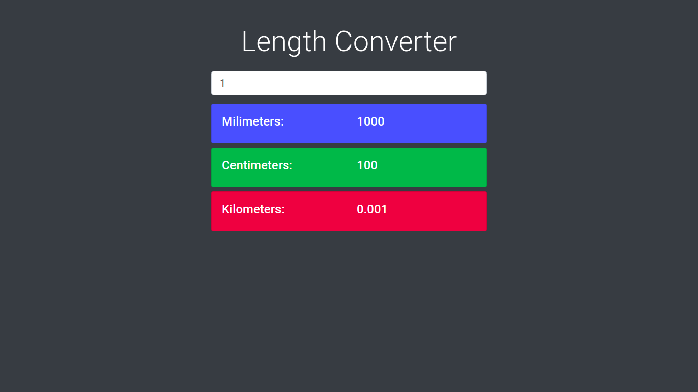

# Length Converter with Bootstrap front-end
 Simple length converter built using nothing but vanilla JavaScript and [Bootstrap](https://getbootstrap.com/).

The project was created basing on [Brad Traversy](https://www.traversymedia.com/) tutorial.

